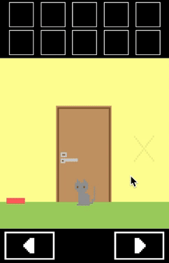
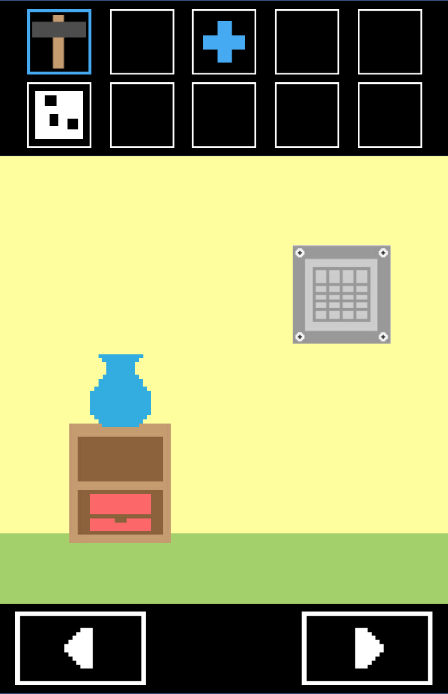
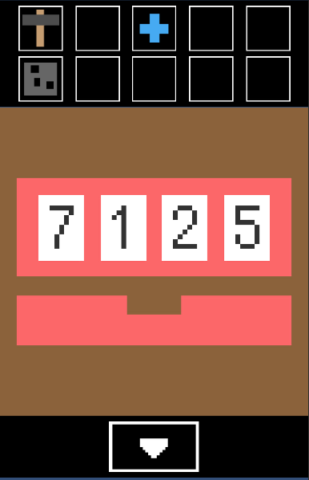

# MY ROOM (Room Escape Game)
## DEMO
　　　　　　

## What
- シンプルな2D脱出ゲームです。
- クリアの想定所要時間は5分です。
## How to play
- 色々な場所を調べてナゾを解き、部屋から脱出できればゲームクリアとなります。
## Production Environment
⭐️追加予定(デプロイ先　テストアカウント＆ID)
## Development Environment
- C#
- Unity
- Illustrator
- Visual Studio Code
- macOS
## Author
- [GitHub](https://github.com/yumiki06/)

---

## Why
- 子供の頃にゲームが大好きで、ずっと自分で作ってみたいと思っていた為開発を決めました。
- 脱出ゲームは同じ動作を何度も繰り返す為、短期間での開発が可能だと考えました。
- 視覚的に操作可能なUnityを使用することで、技術力不足を補えると考えました。
## Points
- ナゾは全て自分で考えたオリジナルのものです。
  - Verbalな説明は排除し、国籍に関係なく遊べるようにしました。
- 背景やオブジェクトは全て自分でデザインしたものです。
  - 制作時間を短縮する為、グリッドを用いてドットイラストを描きました。
- パスワードギミックについて
  - 配列を使用し、1つずつ数字が増え最後の数字まで来たら最初に折り返すように実装しました。
  - foreachを使用し、配列から1つずつ数値を取り出すことでパスワードの真偽判定を行いました。
- アイテムごとのアクションについて
  - クラスの継承を使用し、同一の記述を何度もすることを避けました。
- アイテムコレクト画面（UI）について
  - フラグ管理により、一度使用したアイテムは選択不可にしました。
## Hoping to...
- アイテム合成機能の実装
- ヒント機能の実装
- オートセーブ機能の実装
- App Storeでの公開
