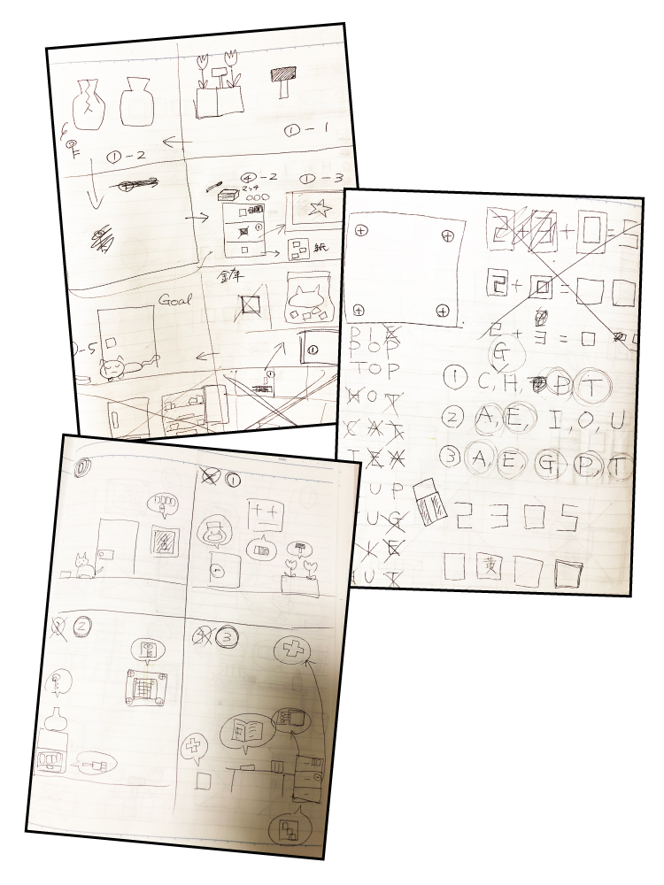

# MY ROOM (Room Escape Game)
## DEMO
　　　　　　

## What
- シンプルな2D脱出ゲームです。
- クリアの想定所要時間は5分です。
## How to play
- 色々な場所を調べてナゾを解き、部屋から脱出できればゲームクリアとなります。
- コレクト画面のアイテムを選択した状態で、任意のオブジェクトをクリックすると、アイテムを使用することができます。
## Production Environment
https://unityroom.com/games/my-room
## Development Environment
- C#
- Unity
- Illustrator
- Visual Studio Code
- macOS
## Author
- [GitHub](https://github.com/yumiki06/)

----------------------------------------------------------------------------------------------------

## Why
- 子供の頃にゲームが好きで自分で作ってみたいと思っていた為開発を決めました。
- 高難易度の脱出ゲームが増えている為、通勤時間等に気軽に遊べる難易度のものがあればいいな、という思いで開発しました。
- 脱出ゲームは同じ動作を何度も繰り返す為、短期間での開発が可能だと考えました。
## Points
- ナゾは全て自分で考えたオリジナルのものです。
  - Verbalな説明は排除し、国籍に関係なく遊べるようにしました。
- 背景やオブジェクトは全て自分でデザインしたものです。
  - 制作時間を短縮する為、グリッドを用いてドットイラストを描きました。
- パスワードギミックについて
  - 配列を使用し、1つずつ数字が増え最後の数字まで来たら最初に折り返すように実装しました。
  - foreachを使用し、配列から1つずつ数値を取り出すことでパスワードの真偽判定を行いました。
- アイテムごとのアクションについて
  - クラスの継承を使用し、同一の記述を何度もすることを避けました。
- アイテムコレクト画面（UI）について
  - フラグ管理により、一度使用したアイテムは選択不可にしました。
## Hoping to...
- オートセーブ機能の実装
